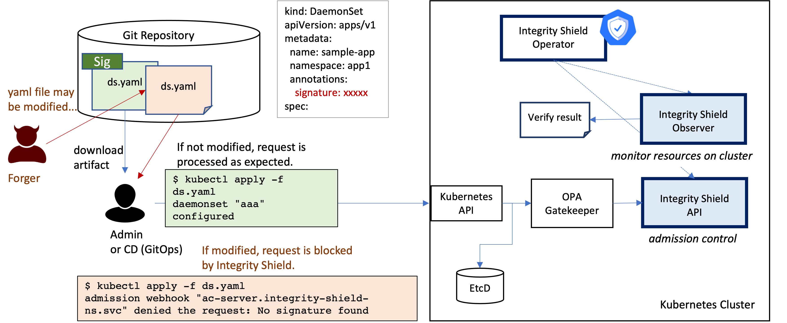
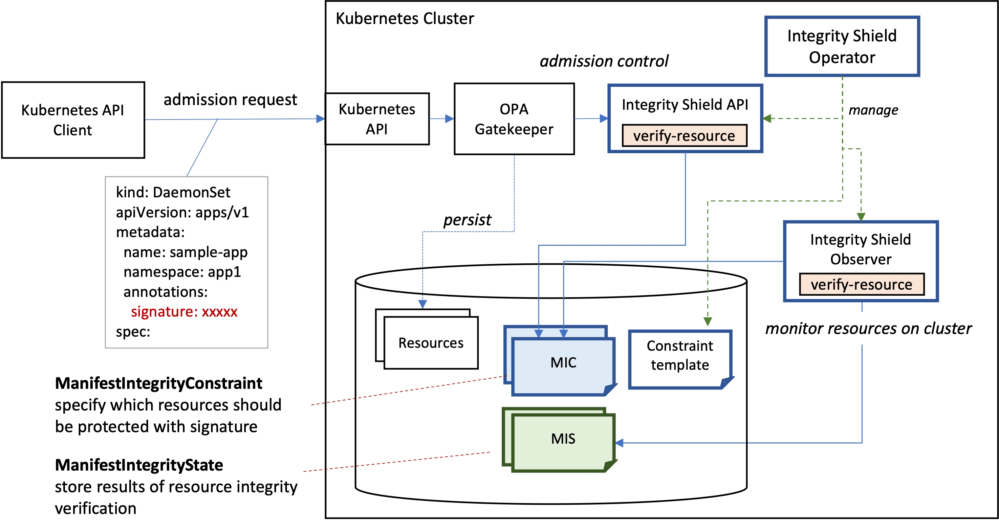

# Integrity Shield
Kubernetes resources are represented as YAML files, which are applied to clusters when you create and update the resource. The YAML content is designed carefully to achieve the application desired state and should not be tampered with. If the YAML content is modified maliciously or accidentally, and applied to a cluster without notice, the cluster moves to an unexpected state.

Integrity Shield provides preventive control for enforcing signature verification for any requests to create or update resources. Integrity Shield also provides continuous monitoring based on signature verification.



## Features 

Two modes are selectively enabled on your cluster. 
- Enforce (Admission Control): Block to deploy unauthorized Kubernetes resources. Integrity Shield works with OPA/Gatekeeper to enable admission control based on signature verification for Kubernetes resources. 
- Detect (Continuous Monitoring): monitor Kubernetes resource integrity and report if unauthorized Kubernetes resources are deployed on cluster

X509, PGP and Sigstore signing are supported for singing Kubernetes manifest YAML. K8s Integrity Shield supports Sigstore signing by using [k8s-manifest-sigstore](https://github.com/sigstore/k8s-manifest-sigstore).

## Architecture



Integrity Shield has two components mainly: API and Observer.

Integrity Shield API receives a k8s resource from OPA/Gatekeeper, validates the resource which is included in the admission request and sends the verification result to OPA/Gatekeeper. Integrity Shield API uses verify-resource function of k8s-manifest-sigstore internally to verify k8s manifest.

Integrity Shield API validates resources according to ManifestIntegrityConstraint which is a custom resource based on constraint framework of OPA/Gatekeeper. 

Integrity Shield Observer continuously verifies Kubernetes resource on cluster according ManifestIntegrityConstraint resources and exports the results to resources called ManifestIntegrityState.
Integrity Shield Observer also uses k8s-manifest-sigstore to verify signature.


## Installation
Prerequisite: you'll need OPA/Gatekeeper installed on your cluster before you install Integrity Shield. 
1. install operator
This Operator will be installed in the "integrity-shield-operator-system" namespace.
If you want to install other namespace, please follow this [instruction](docs/README_QUICK.md).

```
kubectl create -f https://raw.githubusercontent.com/open-cluster-management/integrity-shield/master/integrity-shield-operator/deploy/integrity-shield-operator-latest.yaml
```

2. install Integrity Shield CR
```
kubectl create -f https://raw.githubusercontent.com/open-cluster-management/integrity-shield/master/integrity-shield-operator/config/samples/apis_v1_integrityshield.yaml -n integrity-shield-operator-system
```

## Tutorials
To get started with Integrity Shield, try out our [getting started tutorial](docs/README_GETTING-STARTED-TUTORIAL.md).

To start signing Kubernetes manifest, see this [document](docs/README_SIGNING.md).

## Supported Versions
### Platforms
Integrity Shield can be deployed with operator. We have verified the feasibility on the following platforms:

- [RedHat OpenShift 4.7.1 and 4.9.0](https://www.openshift.com)  
- [Kuberenetes v1.19.7 and v1.21.1](https://kubernetes.io)

### OPA/Gatekeeper
- [gatekeeper-operator.v0.2.0](https://github.com/open-policy-agent/gatekeeper)
- [gatekeeper v3.5](https://github.com/open-policy-agent/gatekeeper)